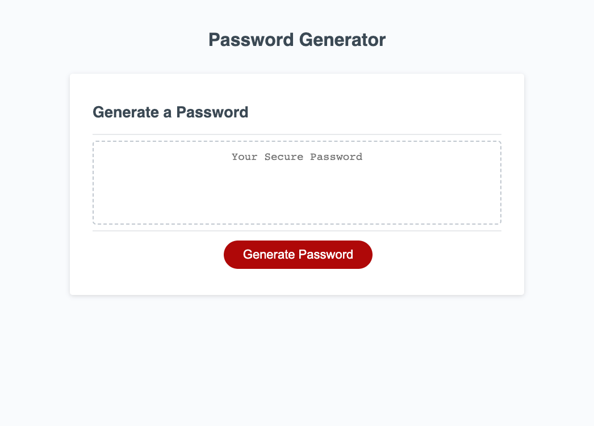

# pwgenerator

## Description
I created a new repo in gitHub name pwgenerator
and cloned it to my bootcamp file.

Javascript:
I created a var that displayed a window prompt asking for the length I wanted the password generator to be. I added if statements to show alerts for if the length of the password was less than eight or greater than 128, and if the the length typed in was anything other than a number to stop and return. I created var's to ask if I wanted to use different characters in my password using window.confirm. I created different var's using strings for those different characters. I then combined all of my characters into one array using .concat. I used a for loop to then push a new var that I created to pick all characters i want in my generator randomly. I then turned my password array into a string and used .join to remove the commas in my generated password. 

## Usage
